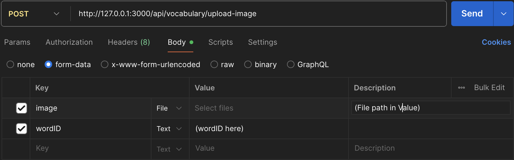

# Vocabulary API Contract

<aside>
🔗

- Base URL: `http://localhost:3000/api/vocabulary`
- Note: In route definitions below, the `/api/vocabulary` prefix is omitted for brevity
- Authentication Headers (Cho các endpoint cần xác thực):
  `Authorization: Bearer <jwt_token>`

</aside>

# 1. **Create a New Vocabulary List**

### Endpoint

```
POST /lists
```

### Request Body

```json
{
  "title": "IELTS Academic Words - Unit 1",
  "description": "Essential vocabulary for the IELTS reading section, focusing on academic topics.",
  "privacy_setting": "private",
  "tags": ["ielts", "academic", "reading"]
}
```

### Response Success (201)

```json
{
  "success": true,
  "message": "Vocabulary list created successfully.",
  "data": {
    "list": {
      "id": "a1b2c3d4-e5f6-7890-1234-567890abcdef",
      "creator_id": "user-uuid-from-jwt",
      "title": "IELTS Academic Words - Unit 1",
      "description": "Essential vocabulary for the IELTS reading section, focusing on academic topics.",
      "privacy_setting": "private",
      "tags": ["ielts", "academic", "reading"],
      "wordCount": 0,
      "created_at": "2023-10-20T10:00:00.000Z",
      "updated_at": "2023-10-20T10:00:00.000Z"
    }
  }
}
```

### Response Error (400)

```json
{
  "success": false,
  "errors": [
    {
      "field": "title",
      "message": "Title is required and must be between 3 and 100 characters."
    },
    {
      "field": "tags",
      "message": "One or more tags are invalid. The tag 'new-science-tag' does not exist."
    }
  ]
}
```

# 2. **Get All of User's Vocabulary Lists**

### Endpoint

```
GET /my-lists?
q=academic&privacy=private&sortBy=updated_at:desc&page=1&limit=20
```

**Query Parameters**

- q (Optional): A query string to filter lists where the title or description contains the text.
- **privacy** (Optional): Filters by public or private.
- **sortBy** (Optional): Sorts results. Format: field:direction (e.g., title:asc).
- **page** (Optional, number, default: 1): The page number to retrieve.
- **limit** (Optional, number, default: 20): The number of items to return per page.

### Response Success (200)

```json
{
  "success": true,
  "data": {
    "lists": [
      {
        "id": "b2c3d4e5-f6a7-8901-2345-67890abcdef1",
        "creator": {
          "id": "user-uuid-789",
          "display_name": "Jane Doe",
          "role": "teacher"
        },
        "title": "Advanced Business English",
        "description": "Essential vocabulary for the IELTS reading section.",
        "tags": ["ielts", "core-vocab"],
        "privacy_setting": "private",
        "wordCount": 95,
        "created_at": "2023-10-20T10:00:00.000Z"
      }
    ]
  },
  "pagination": {
    "currentPage": 1,
    "totalPages": 3,
    "totalItems": 55,
    "limit": 20
  }
}
```

# **3. Search Public Vocabulary Lists**

### **Endpoint**

```
GET /search?
q=business&tags=english,finance&sortBy=wordCount:desc&page=1
```

**Query Parameters**

- **q** (Optional): The search query to match against list titles and descriptions.
- **tags** (Optional): A comma-separated list of tags to filter by (e.g., english,finance).
- **sortBy** (Optional): Sorts results.
- **page** (Optional, number, default: 1): The page number to retrieve.
- **limit** (Optional, number, default: 20): The number of items to return per page.

### Response Success (200)

```json
{
  "success": true,
  "data": {
    "lists": [
      {
        "id": "b2c3d4e5-f6a7-8901-2345-67890abcdef1",
        "creator": {
          "id": "user-uuid-789",
          "display_name": "Jane Doe",
          "role": "teacher"
        },
        "title": "Advanced Business English",
        "description": "Essential vocabulary for the IELTS reading section.",
        "tags": ["ielts", "core-vocab"],
        "privacy_setting": "private",
        "wordCount": 95,
        "created_at": "2023-10-20T10:00:00.000Z"
      }
      /* ... other lists ... */
    ]
  },
  "pagination": {
    "currentPage": 1,
    "totalPages": 1,
    "totalItems": 1,
    "limit": 20
  }
}
```

# 4. **Get a Specific Vocabulary List**

### **Endpoint**

```
GET /lists/:listId
```

### Response Success (200)

```json
{
  "success": true,
  "data": {
    "list": {
      "id": "a1b2c3d4-e5f6-7890-1234-567890abcdef",
      "creator": {
        "id": "some-user-uuid",
        "display_name": "Phan The Hoang",
        "role": "teacher"
      },
      "title": "IELTS Academic Words - Unit 1",
      "description": "Essential vocabulary for the IELTS reading section.",
      "tags": ["ielts", "core-vocab"],
      "privacy_setting": "private",
      "wordCount": 95,
      "created_at": "2023-10-20T10:00:00.000Z"
    }
  }
}
```

# 5. **Update a Vocabulary List**

### Endpoint

```
PUT /lists/:listId
```

### **Request Body**

```json
{
  "title": "IELTS Academic Vocabulary - Unit 1 (Revised)",
  "description": "Essential vocabulary for all sections of the IELTS exam.",
  "tags": ["ielts", "core-vocab"],
  "privacy_setting": "public"
}
```

### Response Success (200)

```json
{
  "success": true,
  "message": "Vocabulary list updated successfully.",
  "data": {
    "list": {
      "id": "a1b2c3d4-e5f6-7890-1234-567890abcdef",
      "title": "IELTS Academic Vocabulary - Unit 1 (Revised)",
      "tags": ["ielts", "core-vocab"],
      "privacy_setting": "public",
      "updated_at": "2023-10-20T11:30:00.000Z"
    }
  }
}
```

### **Response Error (400)**

```json
{
  "success": false,
  "errors": [
    {
      "field": "tags",
      "message": "One or more tags are invalid. The tag 'new-science-tag' does not exist."
    }
  ]
}
```

# 6. **Delete a Vocabulary List**

### Endpoint

```
DELETE /lists/:listId
```

### Response Success (200)

```json
{
  "success": true,
  "message": "Vocabulary list deleted successfully."
}
```

# 7. **Add a Word to a List**

### Endpoint

```
POST /lists/:listId/words
```

### Request Body

```json
{
  "term": "Principle",
  "definition": "A fundamental truth or proposition that serves as the foundation...",
  "translation": "Word definition",
  "phonetics": "/ˈprɪnsəpəl/",
  "image_url": "http://.../image.jpg",
  "exampleSentence": "The principle of free speech is essential in a democracy.",
  "synonyms": ["foundation", "standard", "truth"]
}
```

### Response Success (201)

```json
{
    "success": true,
    "message": "Word added successfully.",
    "data": {
        "word": {
            "id": "word-uuid-3",
            "term": "Principle",
					  "definition": "A fundamental truth or proposition that serves as the foundation...",
					  "translation": "Word definition",
					  "phonetics": "/ˈprɪnsəpəl/",
					  "image_url": "http://.../image.jpg",
					  "vocabulary_examples": {
                "vocabulary_id": "word-uuid-3",
                "example_sentence": "She always acts according to her principles.",
            },
					  "synonyms": ["foundation", "standard", "truth"]
            "created_at": "2023-10-20T12:00:00.000Z"
        }
    }
}
```

# 8. **Bulk Word Operations**

### Endpoint

```
POST /lists/:listId/words-bulk
```

### Request Body

```json
{
  "words": [
    {
      "term": "Eminent",
      "definition": "Famous and respected within a particular sphere or profession.",
      "phonetics": "/ˈɛmɪnənt/",
      "image_url": "http://.../public/word_images/your-user-id/image.jpg",
      "exampleSentence": "She is an eminent scholar of ancient history.",
      "translation": "A random translation",
      "synonyms": ["prominent", "distinguished", "renowned"]
    },
    {
      "term": "Imminent",
      "definition": "About to happen.",
      "phonetics": "/ˈɪmɪnənt/"
    },
    {
      "term": "Invalid Term"
    }
  ]
}
```

### Response Success (201)

```json
{
  "success": true,
  "message": "Bulk operation completed.",
  "data": {
    "createdCount": 2,
    "failedCount": 1,
    "errors": [
      {
        "itemIndex": 2,
        "term": "Invalid Term",
        "reason": "Definition is a required field."
      }
    ]
  }
}
```

# 9. **Update a Word in a List**

### Endpoint

```
PUT /words/:wordId
```

### Request Body

```json
{
  "term": "Principle",
  "definition": "A fundamental truth or proposition that is the foundation for a system of belief or behavior.",
  "translation": "Word definition",
  "phonetics": "/ˈprɪnsəpəl/",
  "image_url": "http://.../public/word_images/your-user-id/image.jpg"
  "exampleSentence": "She always acts according to her principles."
  "synonyms": ["foundation", "standard", "truth", "axiom"]
}
```

### Response Success (200)

```json
{
  "success": true,
  "message": "Word updated successfully.",
  "data": {
    "word": {
      "id": "word-uuid-3",
      "term": "Principle",
      "definition": "...",
      "translation": "Word definition",
      "phonetics": "...",
      "image_url": "http://.../image.jpg",
      "updated_at": "2023-10-20T12:30:00.000Z",
      "vocabulary_examples": {
        "vocabulary_id": "word-uuid-3",
        "example_sentence": "She always acts according to her principles."
      },
      "synonyms": ["foundation", "truth", "standard"]
    }
  }
}
```

# 10. **Delete a Word from a List**

### Endpoint

```
DELETE /words/:wordId
```

### Response Success (200)

```json
{
  "success": true,
  "message": "Word deleted successfully."
}
```

# **11. Get Words for a Specific Vocabulary List**

### Endpoint

```
GET /lists/:listId/words?page=1&limit=25
```

### **Query Parameters**

- **page** (Optional, number, default: 1): The page number of words to retrieve.
- **limit** (Optional, number, default: 25): The number of words to return per page.

### **Response Success (200)**

```json
{
  "success": true,
  "data": {
    "words": [
      {
        "id": "word-uuid-1",
        "term": "Analyze",
        "definition": "To examine in detail...",
        "translation": "Word definition",
        "phonetics": "/ˈænəlaɪz/",
        "image_url": null,
        "vocabulary_examples": {
            "vocabulary_id": "word-uuid-1",
            "example_sentence": "The scientist will analyze the data.",
        },
        "synonyms": ["examine", "inspect", "scrutinize"]
      },
      {
        "id": "word-uuid-2",
        "term": "Context",
        "definition": "The circumstances that form...",
        "translation": "Word definition",
        "phonetics": "/ˈkɒntɛkst/",
        "image_url": "http://.../image.jpg",
        "vocabulary_examples": null,
        "synonyms": []
      }
    ]
  },
  "pagination": { ... }
}
```

# 12. **Upload an Image for a Word**

### Endpoint

```
POST /upload-image
```

### Request Body

The request's Content-Type header **must be** multipart/form-data. The body should be structured as key-value pairs.

| **Field Name (Key)** | **Type (in Postman)** | **Required** | **Description**                                                                                          |
| -------------------- | --------------------- | ------------ | -------------------------------------------------------------------------------------------------------- |
| image                | **File**              | **Yes**      | The image file itself. The key name image must be used.                                                  |
| wordId               | Text                  | No           | **Optional.** If provided, the system will immediately update the specified word with the new image URL. |

### Example



### Response Success (201)

```json
{
  "success": true,
  "message": "Image uploaded successfully.",
  "data": {
    "imageUrl": "http://127.0.0.1:54321/storage/v1/object/public/word_images/your-user-id/1678886400000-example.jpg"
  }
}
```

### **Response Error (413) - Payload Too Large**

```json
{
  "success": false,
  "error": "File too large"
}
```

# **13. Get All Available Tags**

### Endpoint

```
GET /tags
```

### **Response Success (200)**

```json
{
  "success": true,
  "data": {
    "tags": [
      "ielts",
      "academic",
      "reading",
      "business",
      "finance",
      "english",
      "core-vocab",
      "biology",
      "chemistry"
    ]
  }
}
```

# **14. Search Words Within a List**

### Endpoint

```
GET /lists/{listId}/words/search?
q=propos&sortBy=term:asc&page=1&limit=10
```

**Query Parameters**

- **q** (Optional): The search query to match against the term or definition of words in the list.
- **sortBy** (Optional): Sorts results.
- **page** (Optional, number, default: 1): The page number to retrieve.
- **limit** (Optional, number, default: 20): The number of items to return per page.

### **Response Success (200)**

```json
{
  "success": true,
  "data": {
    "words": [
      {
        "id": "word-uuid-15",
        "term": "First principles",
        "definition": "A foundational proposition or assumption that stands alone.",
        "phonetics": "/fɜrst ˈprɪnsəpəlz/",
        "image_url": null,
        "created_at": "2023-10-22T10:00:00.000Z"
      },
      {
        "id": "word-uuid-3",
        "term": "Principle",
        "definition": "A fundamental truth or proposition that is the foundation...",
        "phonetics": "/ˈprɪnsəpəl/",
        "image_url": "http://.../public/word_images/user-id/image.jpg",
        "created_at": "2023-10-20T12:00:00.000Z"
      }
    ]
  },
  "pagination": {
    "currentPage": 1,
    "totalPages": 1,
    "totalItems": 2,
    "limit": 10
  }
}
```

**Response Error (400) - Bad Request**

```json
{
  "success": false,
  "errors": [
    {
      "field": "q",
      "message": "A search query 'q' is required."
    }
  ]
}
```

```json
{
  "success": false,
  "errors": [
    {
      "field": "sortBy",
      "message": "Invalid sort format. Use 'field:direction' (e.g., term:asc)."
    }
  ]
}
```

# **15. Get a Specific Word**

### Endpoint

```
GET /words/:wordId
```

### **Response Success (200)**

```json
{
  "success": true,
  "data": {
    "word": {
      "id": "word-uuid-3",
      "list_id": "a1b2c3d4-e5f6-7890-1234-567890abcdef",
      "term": "Principle",
      "definition": "A fundamental truth that is the foundation for a system of belief.",
      "translation": "Nguyên tắc",
      "phonetics": "/ˈprɪnsəpəl/",
      "image_url": "http://.../public/word_images/user-id/image.jpg",
      "created_at": "2023-10-20T12:00:00.000Z",
      "updated_at": "2023-10-20T12:30:00.000Z",
      "examples": [
        {
          "id": "example-uuid-1",
          "example_sentence": "She always acts according to her principles."
        }
      ],
      "synonyms": ["foundation", "truth", "standard", "axiom"],
      "userProgress": {
        // or '"userProgress": null'
        "nextReviewDate": "2025-08-15T10:00:00.000Z",
        "intervalDays": 6,
        "easeFactor": 2.5,
        "repetitions": 2,
        "correctCount": 5,
        "incorrectCount": 1,
        "lastReviewedAt": "2025-07-29T10:00:00.000Z"
      }
    }
  }
}
```

# 16. Generate Example for Word

Generate a single example sentence for a vocabulary word.

**Endpoint:** `POST /words/:wordId/generate-example`

**Parameters:**

- `wordId` (UUID, required): The ID of the word

**Request Body:**

```json
{
  "context": "business" // Optional: Context for the example
}
```

**Response:**

```json
{
  "success": true,
  "message": "Example generated successfully.",
  "data": {
    "example": {
      "wordId": "30000000-0000-0000-0000-000000000002",
      "term": "analyze",
      "example": "We need to analyze sales data to understand why profits are down this quarter.\n"
    }
  }
}
```

# 17. Generate Example for New Word

Generate a single example sentence for a new vocabulary word that hasn't been saved yet (used during vocabulary list creation).

**Endpoint:** `POST /generate-example`

**Request Body:**

```json
{
  "term": "analyze",
  "definition": "To examine in detail for purposes of explanation and interpretation",
  "context": "business" // Optional: Context for the example
}
```

**Response:**

```json
{
  "success": true,
  "message": "Example generated successfully.",
  "data": {
    "example": {
      "term": "analyze",
      "example": "We need to analyze sales data to understand why profits are down this quarter.",
      "aiGenerated": true,
      "generationPrompt": "Generate example for \"analyze\" (To examine in detail for purposes of explanation and interpretation) in context: business"
    }
  }
}
```

**Error Response (400) - Validation Error:**

```json
{
  "success": false,
  "errors": [
    {
      "field": "term",
      "message": "Term is required and must be between 1 and 200 characters."
    },
    {
      "field": "definition",
      "message": "Definition is required and must be between 1 and 1000 characters."
    }
  ]
}
```

---

# Common Error Responses

### Validation Error (400)

```json
{
  "success": false,
  "errors": [
    {
      "field": "term",
      "message": "Term is a required field."
    }
  ]
}
```

### **Unauthorized (401)**

```json
{
  "success": false,
  "error": "Unauthorized: Invalid or expired token."
}
```

### **Forbidden (403)**

```json
{
  "success": false,
  "error": "Forbidden: You do not have permission to perform this action."
}
```

### **Not Found (404)**

```json
{
  "success": false,
  "error": "Resource not found."
}
```

### **Rate Limit Exceeded (429)**

```json
{
  "success": false,
  "error": "Too many requests. Please try again later."
}
```

### Server Error (500)

```json
{
  "success": false,
  "error": "Internal server error"
}
```

### **Service Unavailable (503)**

```json
{
  "success": false,
  "error": "Service is temporarily unavailable. Please try again in a few minutes."
}
```

---

# Implementation Notes for Frontend

## Image Upload

### **Create the File Input UI**

```html
// Example in a React component
<input type="file" accept="image/*" onChange="{handleFileChange}" />
```

### **Handle the File Selection**

```jsx
import { useState } from "react";

function WordEditor() {
  const [selectedFile, setSelectedFile] = useState(null);
  const [imageUrl, setImageUrl] = useState(""); // To store the URL from the backend

  const handleFileChange = (event) => {
    if (event.target.files && event.target.files[0]) {
      setSelectedFile(event.target.files[0]);
    }
  };

  // ... rest of the component
}
```

### **Prepare the FormData for Upload**

```jsx
const handleImageUpload = async () => {
  if (!selectedFile) {
    alert("Please select an image first!");
    return;
  }

  // Create a new FormData object
  const formData = new FormData();

  // Append the file. The key 'image' MUST match the API contract.
  formData.append("image", selectedFile);

  // You can optionally append other text data, like a wordId
  // formData.append('wordId', 'some-uuid-if-needed');

  // Now, you're ready to send this formData to the backend.
  // See Step 4.
};
```

### **Make the API Call to Upload the Image**

```jsx
const uploadImageAndGetUrl = async (formData) => {
  try {
    const response = await fetch(
      "http://localhost:3000/api/vocabulary/upload-image",
      {
        method: "POST",
        headers: {
          // The browser sets Content-Type automatically for FormData
          Authorization: `Bearer <your_jwt_token>`,
        },
        body: formData,
      }
    );

    if (!response.ok) {
      const errorData = await response.json();
      throw new Error(errorData.error || "Image upload failed");
    }

    const result = await response.json();
    return result.data.imageUrl; // The URL we need for the next step
  } catch (error) {
    console.error("Upload Error:", error);
    // Handle the error in your UI
    return null;
  }
};
```

### **Use the Returned imageUrl**

```jsx
const handleSaveWord = async () => {
  // Assume 'term' and 'definition' are in state
  const wordData = {
    listId: "some-list-id",
    term: "Example",
    definition: "This is an example word.",
    phonetics: "/ɪɡˈzæmpəl/",
    image_url: imageUrl, // <-- HERE is where you use the URL
  };

  // Make the API call to create or update the word
  await fetch("http://localhost:3000/api/vocabulary/create-word", {
    method: "POST",
    headers: {
      "Content-Type": "application/json",
      Authorization: `Bearer <your_jwt_token>`,
    },
    body: JSON.stringify(wordData),
  });
};
```
